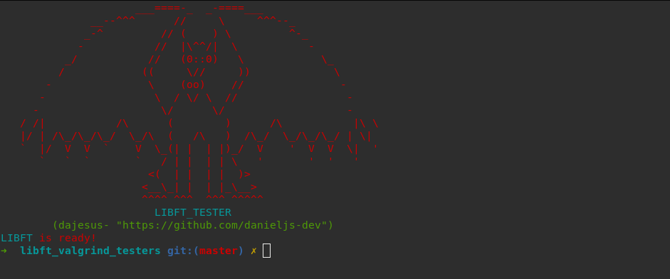

# Test runner for the Libft 42 École project
- A test suite with happy path testing, unhappy path tests, and valgrind to test memory leaks.

# How to use it ?
- Clone the repository in your Libft directory, go in the tester directory, and run `make` with an argument:

```shell
cd Your_Libft_Folder
```
```bash
git clone git@github.com:danieljs-dev/libft_valgrind_testers.git
```
```shell
cd libft_valgrind_testers
```
```bash
make
make test
```

- To test valgrind, run the command
```bash
make valgrind
```

- If you want to run valgrind in quiet mode, run:
```bash
make valgrind QUIET=1
```

- Follow the following directory structure
```
/project
    /libft
        Makefile
        libft.h
        ft_atoi.c
        ft_split.c
        ...
        /libft_valgrind_testers
            Makefile
            test_ft_atoi.c
            test_ft_split.c
```
